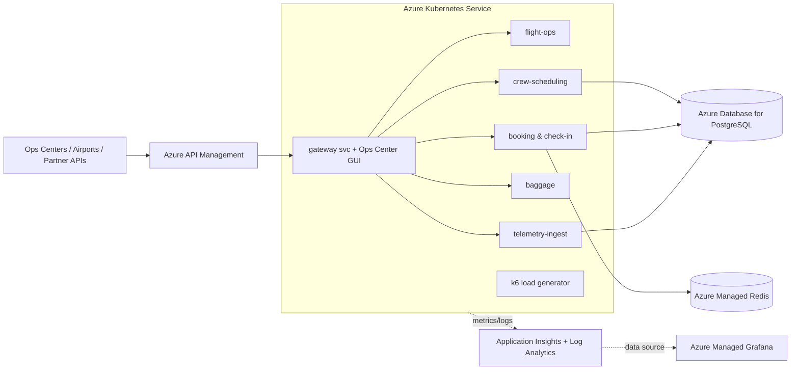

# Aetherion AirOps — Azure SRE Agent MicroHack

A complete, disposable environment for a 1-day Azure SRE Agent MicroHack. It provisions a realistic **multi-tier** aviation operations platform (**APIM → AKS microservices → PostgreSQL + Redis**) with a live **Ops Center GUI**, continuous **k6** load, and **Grafana** dashboards, so attendees can watch incidents happen and use Azure SRE Agent to investigate and remediate across the whole estate.

> Attendee challenge guide: [challenges/ATTENDEE-GUIDE.md](challenges/ATTENDEE-GUIDE.md)
> Documentation site: https://abengtss-max.github.io/azure-sre-agent-microhack/

---

## Documentation site

The full MicroHack site (challenges and reference) is built with
**Material for MkDocs** from `docs/` and published to GitHub Pages from the
`gh-pages` branch — no CI runner required. To update it after editing `docs/`:

```powershell
python -m venv .venv-docs
./.venv-docs/Scripts/python.exe -m pip install -r requirements.txt
./.venv-docs/Scripts/mkdocs.exe gh-deploy --force   # builds + pushes gh-pages
```

Preview locally with `mkdocs serve` (http://127.0.0.1:8000). The
`.github/workflows/docs.yml` workflow is manual-only and only useful if your
account has GitHub-hosted runners.

## Repository layout

| Path | Purpose |
| --- | --- |
| `app/` | Aetherion AirOps application — one Node.js image that runs as any microservice role, plus the Ops Center single-page GUI |
| `k8s/` | Kubernetes manifests (namespace, deployments, services, HPA) |
| `load/` | k6 load generator (normal + surge modes) |
| `dashboards/` | Grafana dashboard JSON (Azure Monitor data source) |
| `infra/` | Bicep infrastructure (AKS, ACR, APIM, PostgreSQL, Redis, Log Analytics, App Insights, Managed Grafana) |
| `scripts/` | One-command provisioning wrapper (`provision-environment.ps1`/`.sh`), plus provider preflight, deploy, validate, fault-injection, reset, teardown |
| `knowledge/` | Markdown knowledge base uploaded to Azure SRE Agent |
| `challenges/` | Attendee challenge guide |

---

## Architecture



---

## Quick start

**Prerequisites:** `az`, `kubectl`, and `helm` on PATH, signed in with `az login`
and the correct subscription selected (`az account set --subscription <id>`).
macOS/Linux additionally needs PowerShell (`pwsh`) — the bash wrapper calls it.

### One command (recommended)

The whole environment builds end to end with a single idempotent command —
provider preflight → deploy infra → build image → deploy app → validate. Safe to
re-run; every underlying step is idempotent.

```powershell
# Windows / PowerShell — from the repo root
./scripts/provision-environment.ps1
```

```bash
# macOS / Linux — from the repo root
./scripts/provision-environment.sh
```

Defaults: resource group `rg-aetherion-microhack`, location `swedencentral`,
name prefix `aetherion`, 3× `Standard_D4s_v5` AKS nodes, `Consumption` APIM. On
success it opens the Ops Center, Grafana, and the portal resource group.

Common overrides:

```powershell
# PowerShell — override any default
./scripts/provision-environment.ps1 -ResourceGroup rg-aetherion -Location eastus `
    -ApimSkuName Developer -AksNodeCount 3 -NoLaunch

# Useful switches: -SkipProviders  -SkipValidate  -NoBanner  -NoLaunch
```

```bash
# bash — positional [resource-group] [location]
./scripts/provision-environment.sh rg-aetherion eastus
```

### Step by step (advanced / troubleshooting)

The wrapper simply chains these idempotent scripts — run them individually if a
single stage needs re-running:

```powershell
# 0. Preflight: verify + register required resource providers (idempotent)
./scripts/00-check-providers.ps1

# 1. Provision infrastructure (Bicep)
./scripts/01-deploy-infra.ps1 -ResourceGroup rg-aetherion -Location eastus

# 2. Build and push the app image to ACR
./scripts/02-build-push-images.ps1 -ResourceGroup rg-aetherion

# 3. Deploy the app + k6 to AKS and wire APIM to the gateway
./scripts/03-deploy-app.ps1 -ResourceGroup rg-aetherion

# 4. Validate the whole environment is healthy and generating traffic
./scripts/04-validate.ps1 -ResourceGroup rg-aetherion
```

Tear everything down at the end:

```powershell
./scripts/99-teardown.ps1 -ResourceGroup rg-aetherion
```

---

## Teardown

**Always delete the resource group at the end** so the environment stops
incurring charges:

```powershell
./scripts/99-teardown.ps1 -ResourceGroup rg-aetherion-microhack
```

---

## Notes

- This is a **fictional, non-production teaching environment**. It uses small/basic SKUs and permissive settings to keep cost and setup friction low. Do not reuse these settings for production.
- Aetherion AirOps models the **operational/business** platform (ops-center decision support), **not** safety-of-flight avionics.
