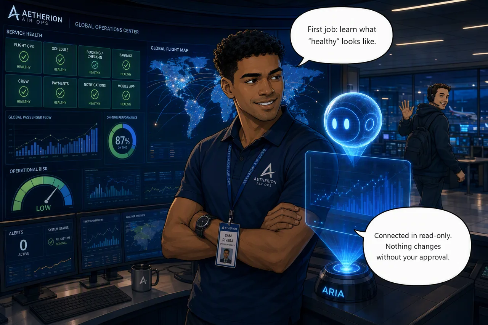

# Challenge 1 — Onboard the Agent and Establish the Baseline

!!! abstract "Challenge 01 of 08 · Act I: Foundation"
    **Run mode:** Review · **Access:** scoped to one resource group · **Estimated time:** 20–30 min

    **Stage:** **Foundation** → Operations → Engineering → Autonomous → Major Incident

**Situation:** You've just taken over the Aetherion AirOps Operations Center at the
start of your shift, and every service tile is green. Before the SRE Agent can help
with real incidents, you need to know what *healthy* looks like, and connect the
agent with least-privilege access in **Review** mode so it proposes changes and
waits for your approval.

**Mission:** Connect the SRE Agent with Reader access, capture a validated
operational baseline, and schedule a proactive daily health check.

**Why this matters**

<div class="grid cards why-cards" markdown>

- :material-chart-box-outline: **Baseline**: Healthy-state reference every later incident is measured against
- :material-flash: **Faster RCA**: Spot anomalies sooner against a known-good benchmark
- :material-lock-outline: **Least privilege**: Scope the agent to one resource group; in **Review** mode it proposes changes and waits for approval
- :material-shield-check-outline: **Proactive ops**: Catch drift before a symptom becomes an outage

</div>

!!! example "Start this challenge"

    ```powershell
    ./scripts/start-challenge.ps1 1   # sets the scene (Challenge 1 injects no fault)
    ```

    Challenge 1 injects nothing, so the board stays green — you create the SRE
    Agent yourself in Task 3 (the order relative to this script does not matter).
    If your Operations Center is **not** all-green (for example you ran a later
    challenge on this environment), reset to a clean baseline first:

    ```powershell
    ./scripts/reset-environment.ps1
    ```

### Tasks

1. **Check the board.** Read the Operations Center once while it's green. That's your reference for the rest of the day.
2. **Confirm telemetry is flowing.** Open Grafana and check that AKS and Application Insights are reporting.
3. **Connect the agent.** Create the SRE Agent in your resource group and give it read access to your code, logs, and Azure resources, in Review mode.
4. **Capture the baseline.** Ask the agent for a baseline of the `aetherion` namespace, then sanity-check a few of its numbers against the Ops Center and Grafana.
5. **Put it on a schedule.** Have the agent re-run that health check every morning so drift shows up before it turns into an incident.

{ .story-panel loading=lazy }

### Suggested Azure SRE Agent prompt

!!! quote "Paste into the agent chat"
    Generate an operational baseline for the `aetherion` namespace, including:
    running services and ready replica counts; dependencies (which services use
    PostgreSQL and Redis, and what sits behind the API front door); normal
    check-in and booking latency; and the top operational signals to watch.
    Support every finding with telemetry evidence, and make no changes.

### Success criteria

- All service tiles are healthy and Grafana shows live metrics.
- The agent is connected to your resource group in **Review** mode, can list every resource, and asks for approval before any change.
- You hold a validated baseline captured while the platform was healthy — whose replica counts and latency match the Ops Center and Grafana.
- A scheduled daily health check exists, with a sensible drift threshold.

!!! success "Verify your work"

    Run this when you're done. It grades the real end state:

    ```powershell
    ./scripts/check-challenge.ps1 1
    ```

### Hints

<details markdown="1"><summary>Hint — orientation & the agent</summary>

Load the Operations Center first and let it settle. Create the agent in the **same
resource group** as the platform, keep it at Reader/Review, and ask it an open
question about the resource group to confirm scope. A write request should produce
an approval prompt, not an action.
</details>

<details markdown="1"><summary>Hint — baseline & proactive</summary>

Ask one specific question about namespace health rather than browsing pod-by-pod,
and cross-check replica counts and latency against the tiles and Grafana. Keep the
baseline somewhere you can find it again mid-incident, and schedule the same
read-only check so the agent watches for drift on its own.
</details>

!!! question "Stuck? Step-by-step for each task"
    Give each task a genuine attempt first and skim the hints above. When you
    want the exact clicks, open the matching task below.

    ??? note "Task 1 · Check the board"
        - Open the **Operations Center** (the provisioner prints its URL, and it's
          already in your browser tabs from setup).
        - Confirm every service tile is **green**. Note the overall state and a
          couple of latency numbers. This is your healthy reference for the day.

    ??? note "Task 2 · Confirm telemetry is flowing"
        - Open **Grafana** (Azure Managed Grafana, linked from your resource group).
        - Check the **AKS** and **Application Insights** panels are showing live
          data. If a panel looks empty, give it a minute to collect data points.

    ??? note "Task 3 · Connect the agent"
        **Create the agent.** Portal → search **Azure SRE Agent** → **Create**. On
        **Basics** set your subscription, your **app resource group**
        (`rg-aetherion-microhack-<suffix>`), a name (`aetherion-sre-agent`), and
        region. For **Application Insights** choose **Create new**: The agent
        provisions its own, separate from the app's. For **model provider**,
        **Azure OpenAI** is a good default (lower cost, EU data boundary). Then
        **Review + create** → **Create**.

        **Set up your agent** is a separate step. **Create** alone grants no app
        access. Choose **Full setup** and connect:

        - **Code** → **GitHub** → sign in → add **your fork** of `aetherion-airops-platform`.
        - **Logs** → **Log Analytics Workspace** → pick the app's **`aetherion-law`**
          (not the agent's own auto-created workspace).
        - **Azure resources** → **Resource group** → select **only your app
          resource group** at the **Reader** level. Do **not** pick *Subscription*
          or *Management group*.

        **Keep Review mode** so the agent proposes actions and waits for approval.
        Its identity is granted Monitoring Contributor plus a reader bundle at
        setup, so the "won't change anything" guarantee comes from **Review mode**,
        not from the role being read-only.

        **Confirm scope.** Ask *"List the resources in my resource group and
        summarize what this application does."* Then ask it to **restart a
        deployment**. In Review mode it must ask for approval, not act.

    ??? note "Task 4 · Capture the baseline"
        - With the board green, paste the baseline prompt (the **Suggested Azure
          SRE Agent prompt** above) into the agent chat.
        - When it answers, spot-check **2–3 numbers** replica counts and check-in
          / booking latency — against the Ops Center tiles and Grafana.
        - If the board was recently degraded, reset and let telemetry settle first,
          or the baseline will record the fault as "normal".

    ??? note "Task 5 · Put it on a schedule"
        You can schedule the baseline two ways, by asking in chat or from the
        **Scheduled tasks** page in the portal.

        **Option A: Ask the agent.** In the chat, say *"Schedule this baseline to
        run every morning at 08:00 and alert me on drift from normal."* It creates
        the scheduled task, resolves the timezone/cron, and sets the conditions.

        **Option B: Configure it in the portal, step by step:**

        1. Open your **Azure SRE Agent** resource, then select **Scheduled tasks**
           in the left sidebar.
        2. Select **Create task** in the toolbar.
        3. Fill in the form:
            - **Task name**: E.g. `Daily baseline health check`.
            - **Task details**: The instruction the agent runs each time, e.g.
              *"Check the health of the `aetherion` namespace, compare replica
              counts and check-in / booking latency against the recorded baseline,
              and summarize any drift."*
            - **Frequency**: `Daily` (`Weekly`, `Monthly`, or a `Custom cron` are
              also available).
            - **Time of day**: E.g. `8:00 AM`.
        4. Review the optional fields:
            - **Response custom agent**: Leave empty to use the main agent.
            - **Message grouping for updates**: "Use same thread" keeps each day's
              results together.
            - **Agent autonomy level**: The default is fine here; because the task
              only asks the agent to check and summarize, it reports rather than
              changing anything.
        5. Select **Create task**. It appears in the list with status **On** and a
           **next run** time.
        6. After the first run, select the task name to open its **execution
           history**: Each run is a thread showing the plan, the tools used, and
           the outcome. To change the schedule or wording later, select the task →
           **Edit task** → **Save** (execution history is preserved).

        **Verify the thresholds** it uses. On a clean baseline the booking path is
        sub-second, so an alert at "p95 > 3 s" would miss real latency.

### Reference

- [Create and set up the SRE Agent](https://learn.microsoft.com/en-us/azure/sre-agent/create-and-set-up)
- [Complete your setup](https://learn.microsoft.com/en-us/azure/sre-agent/complete-setup)
- [Tutorial: Create and edit scheduled tasks](https://learn.microsoft.com/en-us/azure/sre-agent/create-scheduled-task)

!!! success "Up next — the first real symptom"
    Challenge 2 injects the first incident, so your board will go from green to
    degraded. You'll know it's abnormal because you measured normal.

    [Proceed to Challenge 2 · Detect & Investigate →](02-detect-and-investigate.md){ .md-button .md-button--primary }

---
