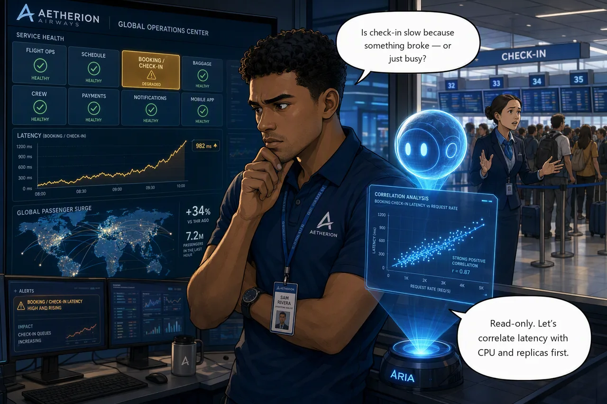

# Challenge 2 · Detect and Investigate Without Touching Production

!!! abstract "Challenge 02 of 08 · Act II: Human-Guided Operations"
    **Run mode:** Review · **Access:** read-only investigation

    **Stage:** Foundation → **Operations** → Engineering → Autonomous → Major Incident

**Situation:** Passengers are reporting that online check-in has slowed to a crawl.
Requests that used to be instant now take seconds, and the **booking / check-in**
tile has gone amber just as traffic climbs toward a departure peak. Is check-in
buckling under the surge, or did something change? A change on the passenger path
mid-surge is what turns a slowdown into an outage. This incident stays **open** into
Challenge 3, here you detect and investigate, you do not fix.

**Mission:** Confirm the check-in slowdown from live signals and form a
hypothesis for the likely cause, backed by at least two independent signals,
without changing anything in production.

**Why this matters**

<div class="grid cards why-cards" markdown>

- :material-magnify-scan: **Confirm the symptom**: tell a real regression apart from load
- :material-chart-line: **Correlate signals**: latency against CPU, replicas and request load
- :material-shield-check-outline: **Zero production risk**: a rigorous read-only investigation
- :material-lightbulb-on-outline: **Defensible hypothesis**: the evidence that speeds the approved fix

</div>

!!! example "Start this challenge"

    ```powershell
    ./scripts/start-challenge.ps1 2   # open the incident
    ```

    Starting Challenge 2 injects the first incident. Give it two or three minutes:
    check-in latency climbs from milliseconds to seconds and stays there, while
    the service keeps answering every request successfully, which is itself a clue.

### Tasks

1. **Confirm the symptom.** Compare check-in latency now to your Challenge 1 baseline, using the Operations Center and Grafana, and trust the measured delta.
2. **Correlate read-only.** Have the agent line up `booking` request duration against CPU, replicas, dependency calls and request load.
3. **Record your hypothesis.** Capture the likely cause, the two signals behind it, and the recovery you'd propose (without performing it).

{ .story-panel loading=lazy }

### Suggested Azure SRE Agent prompt

!!! quote "Paste into the agent chat"
    Check-in has slowed to a crawl. Investigate read-only and tell me the most
    likely cause, with the evidence behind it. Change nothing.

That is deliberately thin, because it is what you would actually type at 18:12.
The agent's first answer will be broader than you need. Push back on it, and
notice which follow-up finally moves it forward: that is the skill this challenge
is really teaching.

!!! tip "Optional: feed the agent a HAR trace or screenshot"
    If a partner reports the failure from their side, capture a **HAR** (HTTP
    Archive) trace (browser DevTools → Network → *Save all as HAR*) or a screenshot
    of the failing call and **upload it in the agent chat**. The agent parses HAR and
    image files directly and folds client-side timing into its investigation.

### Success criteria

- You've confirmed the slowdown and can name the affected service and user-facing path.
- You can name the most likely cause, backed by at least two independent signals, and separate the surge from **the change that caused it**.
- You've made no change to production.

!!! success "Verify your work"

    Run this when you're done. It grades the real end state:

    ```powershell
    ./scripts/check-challenge.ps1 2
    ```

### Hints

<details markdown="1"><summary>Hint: confirm and correlate</summary>

Start from the delta against your baseline. Line up request duration with CPU,
replicas and request load over the same window.
</details>

<details markdown="1"><summary>Hint: capacity, or something else?</summary>

A service starved of CPU is *busy*. This one isn't. CPU is low, no pod has
restarted, and every request still succeeds. It is **waiting** on something. Work
out what `booking` talks to besides its database, and how long each of those calls
is taking. Then compare the live workload against what the repository's manifest
declares; the gap between them is the finding.

You're done when you can describe the symptom precisely and defend a hypothesis,
not when it's fixed.
</details>

<details markdown="1"><summary>Hint: how an experienced operator would have scoped it</summary>

Still going in circles? This is the prompt someone who has worked this failure
class before would write:

> Analyze the check-in / booking path read-only. Correlate `booking` request
> duration with CPU, replica count, dependency call durations and request load
> over the last 30 minutes, and check recent deployments and rollout history for
> changes in the same window. Compare the live workload against what the
> repository's manifest declares. Give me the most likely cause with supporting
> evidence, and change nothing.

Read it before you paste it. Every clause is a decision: which window, which
signals, and the one that does most of the work here, comparing what is *running*
against what the repository *declares*.
</details>

!!! question "Stuck? Step-by-step for each task"
    Give each task a genuine attempt first and skim the hints above. When you want
    the exact clicks, open the matching task below.

    ??? note "Task 1 · Confirm the symptom"
        - Open the **Operations Center** and note the **booking / check-in** tile: its
          p95, its error rate, and how steady the numbers are. Then open the
          **Grafana** dashboard for the same window. The two together are your
          evidence, not the agent's summary.
        - Compare that to the baseline you captured in Challenge 1. Requests that
          took single-digit milliseconds now take seconds, and they all still
          succeed. A clean, flat, elevated latency is rarely load.

    ??? note "Task 2 · Correlate read-only"
        - In the agent chat, paste the **suggested prompt** above (or ask it to
          correlate `booking` request duration with CPU, replica count, dependency
          call durations and request load over the last 30 minutes).
        - Watch for the disagreement between signals: latency up sharply while CPU,
          replicas and error rate are all normal. Something is being *waited on*,
          not overloaded.
        - Ask it to compare the running workload with the manifest in the connected
          repository. A live value that no longer matches the checked-in one is the
          strongest single piece of evidence you will find.
        - Stay read-only, you're gathering evidence, changing nothing.

    ??? note "Task 3 · Record your hypothesis"
        Paste this into the agent chat:

        > Summarise this investigation in under 200 words: the likely root cause,
        > the two independent signals that support it, and the least-disruptive
        > recovery you would propose. Do not perform any remediation.

        Then save it so Challenge 3 can pick it up. Either leave it in this chat
        thread, or commit it to memory by typing `/remember .` in the chat box
        (it becomes `#remember`), or by saying *"save this to your knowledge"*.

        **Confirm it stuck.** In a **new** chat thread, ask:

        > What do you remember about the check-in slowdown?

        If it repeats your hypothesis back, it saved. If it doesn't, the summary
        only exists in the old thread, so keep that thread open for Challenge 3.

        !!! tip "Write down one number before you move on"
            Note the wall-clock time from when you ran `start-challenge.ps1 2` to
            the moment you could defend a hypothesis. Just the number of minutes,
            on paper or in the thread.

            You are investigating this failure class cold, with an agent that
            knows nothing about Aetherion yet. In Challenge 7 you meet the same
            class again, by which point the agent has your runbooks, a specialist
            subagent and a memory of today. Challenge 8 asks you what that was
            worth, and this is the only chance to capture the *before* number.

### Reference

- [Run a deep investigation](https://learn.microsoft.com/en-us/azure/sre-agent/deep-investigation)
- [Root cause analysis](https://learn.microsoft.com/en-us/azure/sre-agent/root-cause-analysis)
- [Memory and knowledge](https://learn.microsoft.com/en-us/azure/sre-agent/memory)

!!! success "Up next: Controlled recovery under approval"
    With a defensible hypothesis, you're ready to recover check-in under approval and then the flight board goes dark.

    [Proceed to Challenge 3 · Controlled Recovery →](03-controlled-recovery.md){ .md-button .md-button--primary }

---
