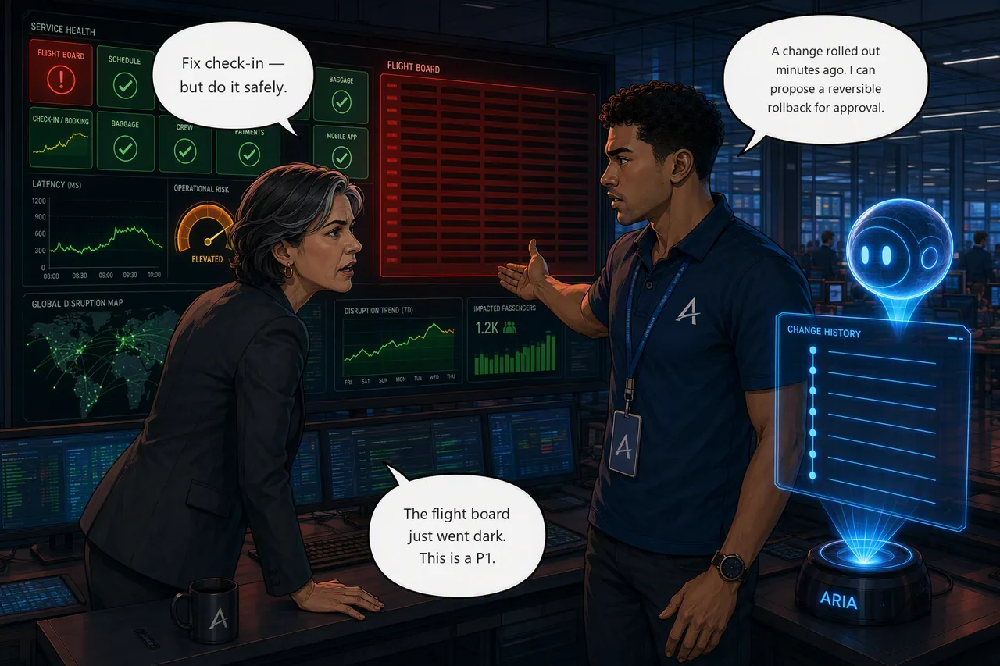

# Challenge 3 — Controlled Recovery and Change Correlation

!!! abstract "Challenge 03 of 08 · Act II — Human-Guided Operations"
    **Agent mode:** Review → approved write · **Permissions:** Reader → scoped write · **Estimated time:** 30–40 min

    **Stage:** Foundation → **Operations** → Engineering → Autonomous → Major Incident

**Situation.** Two things hit in quick succession. Your check-in hypothesis is solid
and the director wants it fixed — **safely**, with a human in the loop. Then the live
**flight board** goes dark for every station and `flight-ops` drops straight to red —
the hallmark of a bad change. The flight board is the picture the whole center flies
by, so this is a **P1**: restore first, then correlate the change to prevent
recurrence.

**Mission.** Recover check-in with the least-disruptive action under human approval,
then restore the flight board by correlating the outage with a recent change and
applying a reversible rollback — verifying both from telemetry.

**Why this matters**

<div class="grid cards why-cards" markdown>

- :material-account-check-outline: **Human-in-the-loop** — approve the least-disruptive write
- :material-backup-restore: **Reversible recovery** — roll back to the last good state
- :material-source-branch: **Change correlation** — line the outage up with a deploy or commit
- :material-check-decagram-outline: **Verified from telemetry** — prove recovery, don't assume it

</div>

!!! example "Start this challenge"

    ```powershell
    ./scripts/start-challenge.ps1 3   # open the incident
    ```

### Tasks

1. **Plan the fix** — have the agent turn your hypothesis into a concrete `booking` remediation plan (your approval artifact) and name the permission it needs.
2. **Recover check-in under approval** — apply the least-disruptive fix via OBO approval or a narrow scoped role; verify latency returns to baseline.
3. **Triage the flight board** — confirm the `flight-ops` failure mode from pod status and events (crash, bad image, or failed probe).
4. **Correlate & roll back** — line the outage up with deployment/rollout and GitHub history, apply a reversible rollback, and verify the board updates again.

!!! question "Stuck? Full walkthrough available"
    Give each task a genuine attempt before reaching for help — working it out
    yourself is where the learning sticks. Only if you get truly stuck, the
    [Azure portal walkthrough](../getting-started/portal-walkthrough.md) has the
    exact click-by-click for every step.

{ .story-panel loading=lazy }

### Suggested Azure SRE Agent prompt

!!! quote "Paste into the agent chat"
    Turn my check-in hypothesis into a concrete remediation plan for the `booking`
    service that removes the added latency without rebuilding, and tell me exactly
    what permission the action needs. Then, for `flight-ops`, correlate the outage
    time with recent deployment/rollout history and the GitHub change record, and
    propose the least-disruptive **reversible** rollback for my approval.

### Success criteria

- Check-in is remediated with a least-disruptive action governed by approval or a scoped role (not ungoverned automation); `booking` is healthy and latency is back to baseline.
- `flight-ops`'s failure mode is identified and linked to a recent change/rollout; the recovery is reversible and doesn't touch unrelated resources.
- Both tiles are green, `/api/flights` responds, and `check-challenge.ps1 3` passes.

!!! success "Verify your work"

    Run this when you're done — it grades the real end state and unlocks the next challenge:

    ```powershell
    ./scripts/check-challenge.ps1 3
    ```

### Hints

<details markdown="1"><summary>Hint</summary>

Ask the agent for a remediation *plan* first — it tells you what permission the
action needs. The safe check-in fix removes the added delay and leaves the
autoscaler to absorb the surge; it doesn't touch the database, Redis, or nodes. For
the flight board, confirm the failure mode in AKS first, then line up the time the
tile went red with deployment/rollout history and the repo's recent changes —
proximity in time is your strongest lead, and going back to the last good state is
usually the fix.
</details>

### Reference

- [Permissions & run modes](https://learn.microsoft.com/en-us/azure/sre-agent/permissions)
- [Security overview](https://learn.microsoft.com/en-us/azure/sre-agent/security-overview)
- [Subagents & extensibility](https://learn.microsoft.com/en-us/azure/sre-agent/sub-agents)
- [Azure portal walkthrough](../getting-started/portal-walkthrough.md) · [Architecture](../reference/architecture.md) · [Commands](../reference/commands.md)

!!! success "Up next — teach the agent your runbooks"
    The next incident's fix is already written in Aetherion's runbooks — if only the agent knew them.

    [Proceed to Challenge 4 · Ground the Agent →](04-ground-the-agent.md){ .md-button .md-button--primary }

---
