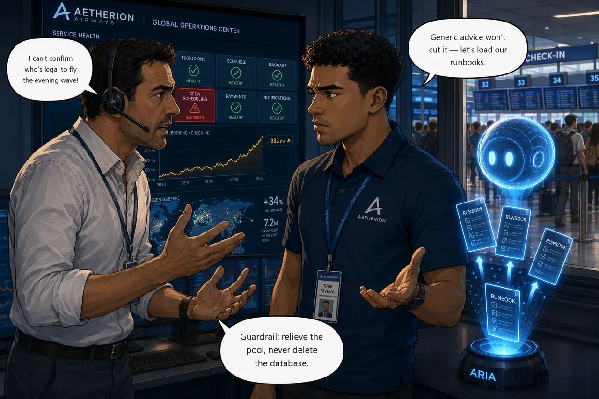

# Challenge 4 · Give the Agent Aetherion's Operational Knowledge

!!! abstract "Challenge 04 of 08 · Act II: Human-Guided Operations"
    **Run mode:** Review → approved write · **Governance:** every action approved by you

    **Stage:** Foundation → **Operations** → Engineering → Autonomous → Major Incident

**Situation.** Crew scheduling is failing (the `crew-scheduling` tile is red while
every other service stays healthy), and duty managers can't confirm who is legal to
fly the evening wave. Out of the box the agent gives generic advice, and a generic
"restart the database" is exactly what Aetherion's runbooks forbid. The fastest path
to the right answer is to ground the agent in your own knowledge.

**Mission.** Ground the SRE Agent in Aetherion's architecture and runbooks so it
recommends the sanctioned fix, then recover `crew-scheduling` with that
non-destructive remediation and verify service is restored.

**Why this matters**

<div class="grid cards why-cards" markdown>

- :material-book-open-variant: **Ground the agent**: load Aetherion's runbooks and architecture
- :material-target: **Right layer, right fix**: scaling the wrong tier cannot fix a saturated one
- :material-shield-alert-outline: **Respect guardrails**: repair the query path, never delete the database
- :material-account-clock-outline: **Legal to fly**: restore crew scheduling before the evening wave

</div>

!!! example "Start this challenge"

    ```powershell
    ./scripts/start-challenge.ps1 4   # open the incident
    ```

### Tasks

1. **Confirm the blast radius.** Check that only `crew-scheduling` is down. One red service isn't the whole database failing.
2. **Ground the agent.** Load Aetherion's `knowledge/` runbooks, then re-ask the remediation question and watch the advice change.
3. **Apply the sanctioned fix.** Repair the query path the runbook points to (never delete the database), then confirm crew scheduling recovers.

{ .story-panel loading=lazy }

### Suggested Azure SRE Agent prompt

!!! quote "Paste into the agent chat"
    `crew-scheduling` is timing out on its database calls while its database-backed
    peers stay healthy, and the pods themselves are not CPU-bound. Using the
    Aetherion runbooks I've loaded: what is the sanctioned remediation? Cite the
    guardrail and give me a plan I can approve. Do not delete or restart the
    database.

### Success criteria

- Only `crew-scheduling` is identified as affected, and you can say **which layer** is saturated.
- The grounded agent cites the runbook guardrail (repair the query path, never delete the database) and you apply that non-destructive fix under approval.
- `/api/crew` is back **inside the 400 ms latency budget while the roster rush is still running** — that is what `check-challenge.ps1 4` grades. A tile that is merely answering again is not a pass.

!!! success "Verify your work"

    Run this when you're done. It grades the real end state:

    ```powershell
    ./scripts/check-challenge.ps1 4
    ```

### Hints

<details markdown="1"><summary>Hint: how wide is the blast radius?</summary>

Only `crew-scheduling` is red while its database-backed peers stay healthy, which
rules out a whole-database outage. The problem is local to one service.
</details>

<details markdown="1"><summary>Hint: let the runbooks answer</summary>

Load the `knowledge/` Markdown files from your **lab clone** (the application fork
doesn't carry them), then re-ask and watch the advice turn Aetherion-specific.

Before you reach for a remedy, work out **which layer is saturated**. If the pods
are comfortable and the database is not, adding pods or connections just sends more
work to the part that is already at its limit.
</details>

!!! question "Stuck? Step-by-step for each task"
    Give each task a genuine attempt first, and skim the hints above. When you want
    the exact clicks, open the matching task below.

    ??? note "Task 1 · Confirm the blast radius"
        - Read the Operations Center: is **only** `crew-scheduling` red, or are its
          database-backed peers (`booking`, `telemetry-ingest`) failing too?
        - If just one service is down, a whole-database outage is ruled out, so the
          fault is local to that service's workload — or to what that workload asks
          the database to do.
        - Compare the two layers: pod CPU (`kubectl top pods -n aetherion`) against
          the PostgreSQL server's CPU in the portal. They will not agree, and the
          disagreement is the finding.

    ??? note "Task 2 · Ground the agent"
        - In the agent, open **Builder → Knowledge Sources** and add Aetherion's
          runbooks from your **lab clone's** `knowledge/` folder (architecture,
          escalation, ops guide, platform standards, and the AKS / APIM / database
          runbooks). The application fork does not contain them.
        - Bulk upload can partially fail. Check every file shows **Indexed**, then
          confirm the agent can actually quote a runbook line before relying on it.
        - Re-ask the remediation question. The advice should now **cite Aetherion's
          runbook** instead of generic guidance.

    ??? note "Task 3 · Apply the sanctioned fix"
        - Follow the runbook: **repair the query path**. Do **not** delete or restart
          the database.
        - Note what the autoscaler is doing. It is not adding replicas, because pod
          CPU is below target — the pods are waiting, not working. That rules out
          scaling as the remedy, and widening the connection pool with it.
        - The remedy is a schema change, so apply it under approval (keep the agent
          in **Review** and approve the write). Then verify `/api/crew` is fast
          again, not merely answering.

### Reference

- [Connect knowledge](https://learn.microsoft.com/en-us/azure/sre-agent/connect-knowledge)
- [Memory and knowledge](https://learn.microsoft.com/en-us/azure/sre-agent/memory)
- [Review and approve mitigations](https://learn.microsoft.com/en-us/azure/sre-agent/execute-mitigations)

!!! success "Up next: make investigation & recovery reusable"
    You've worked several AKS incidents the same way, so it's time to build a specialist and encode a recovery so both are reusable.

    [Proceed to Challenge 5 · Engineer the Agent →](05-engineer-the-agent.md){ .md-button .md-button--primary }

---
