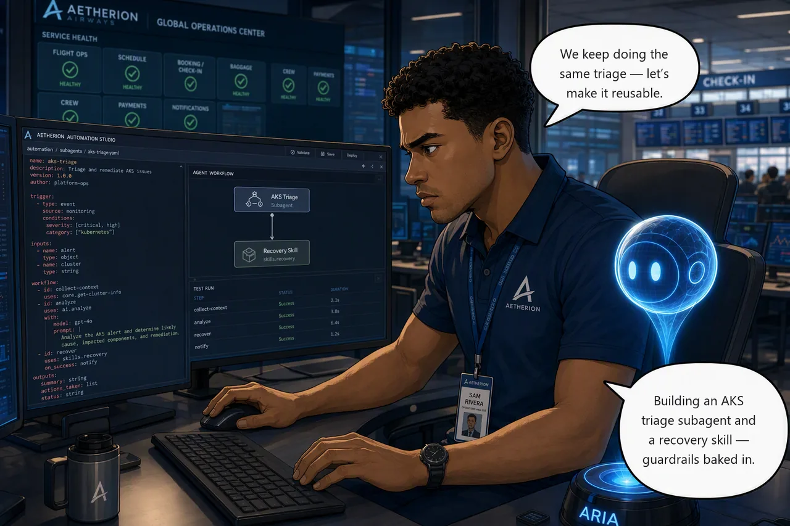

# Challenge 5 · Engineer the Agent: Specialist Subagent and Reusable Skill

!!! abstract "Challenge 05 of 08 · Act III: Agent Engineering"
    **Run mode:** Review · **Focus:** builder, no incident to fix

    **Stage:** Foundation → Operations → **Engineering** → Autonomous → Major Incident

**Situation.** The platform is stable, which is the right time to invest in tooling. You've
repeated the same Kubernetes triage (pod status, events, rollout history, dependency
health) and the same crew query-path recovery across several incidents. Both
investigation *and* recovery are perfect candidates to make reusable.

**Mission.** Build a custom AKS-focused specialist subagent, **scope it to the tools it
actually needs** rather than letting it inherit everything, use it for a scoped
investigation, then encode the crew query-path recovery as a reusable skill with its
guardrails intact.

**Why this matters**

<div class="grid cards why-cards" markdown>

- :material-robot-outline: **Specialist subagent**: scoped AKS triage on demand
- :material-tune-variant: **Scoped, not inherited**: 8 tools instead of 46, and read-only *enforced*
- :material-cog-sync-outline: **Reusable skill**: encode the sanctioned recovery once
- :material-shield-check-outline: **Guardrails baked in**: fix the saturated layer, never delete the database
- :material-rocket-launch-outline: **Faster next time**: handle recurrences without re-deriving steps

</div>

!!! example "Start this challenge"

    ```powershell
    ./scripts/start-challenge.ps1 5   # open / set up this challenge
    ```

    Challenge 5 injects no fault, so the board stays green while you build.

### Tasks

1. **Build the specialist.** Create an AKS triage subagent for the `aetherion` namespace, **scope it to the eight tools it needs**, verify what it actually got, then invoke it to summarize namespace health and likely causes.
2. **Encode the skill.** Capture the crew query-path recovery from Challenge 4 as a reusable skill, guardrails intact, and confirm it loads.
3. **Know when to use which.** Decide whether the new skill belongs to the specialist or the main agent, act on that decision, and be able to say when you'd reach for the subagent (delegate to it to investigate) versus the skill (a procedure the agent can draw on).

{ .story-panel loading=lazy }

### Suggested Azure SRE Agent prompt

!!! quote "Paste into the agent chat"
    Delegate this to your `aks-triage` subagent rather than handling it yourself.
    Triage pod status, events, rollout history and dependency health for the
    `aetherion` namespace, and have the specialist return a scoped health
    assessment with likely causes and the evidence behind them. Tell me
    explicitly which agent produced the answer.

!!! warning "Ask for the subagent by name, or you won't get it"
    Wording like *"act as my AKS reliability specialist"* does **not** invoke the
    subagent. The main agent simply adopts the persona and does the work itself,
    and the answer looks convincing enough that you'd never notice.

    Delegating explicitly, by saying *"delegate this to your `aks-triage` subagent"*, does
    invoke it. You'll see a **Parallel subagent execution** step in the thread,
    and asking *"which agent produced the answer"* gives you a straight answer to
    check against. There is no slash-command syntax; delegation is natural
    language.

### Success criteria

- A custom AKS-specialist subagent exists, is **scoped to a deliberate tool set rather than inheriting all 46**, and you verified via the API that `RunKubectlReadCommand` is present and `RunKubectlWriteCommand` is not.
- You've invoked it for a scoped investigation that produces genuinely useful triage.
- A reusable skill captures the sanctioned recovery, loads/applies correctly, and matches the runbook guardrails.
- You decided **who owns that skill** and acted on it: it stays with the main agent, not the read-only AKS specialist, and you can give the reason.
- You can explain when to reach for the subagent versus the skill, and `check-challenge.ps1 5` passes.

!!! success "Verify your work"

    Both questions are yours to answer honestly. Nothing here changes the platform,
    so the check asks you to confirm what you built:

    ```powershell
    ./scripts/check-challenge.ps1 5
    ```

### Hints

<details markdown="1"><summary>Hint: scope the specialist</summary>

Decide the specialist's remit in one sentence before you build it; narrow beats
broad. Then make that remit real: a subagent that inherits every tool the main agent
has is a persona in a costume, and its "read-only" constraint is a polite request.

Work out its tool list from evidence, not taste. Look at what an AKS investigation
actually used in Challenges 2 to 4, and give it exactly that. Judge the result by
whether its output would speed up a real AKS incident, and by whether it is now
*incapable* of doing the things you never wanted it to do.
</details>

<details markdown="1"><summary>Hint: encode the recovery</summary>

For the skill, reuse the exact steps from Challenge 4 as the backbone and bake in
the guardrails (diagnose which layer is saturated, repair the query path, never
delete or restart the database). Be careful not to encode "scale it" as the answer,
Challenge 4 is precisely the case where scaling cannot work.

Skills encode a procedure the agent can draw on; subagents are delegated to and
investigate. You'll want both in the final incident.
</details>

!!! question "Stuck? Step-by-step for each task"
    Give each task a genuine attempt first, and skim the hints above. When you want
    the exact clicks, open the matching task below.

    ??? note "Task 1 · Build the specialist"
        Both the subagent and the skill are created from the same place: in the
        agent, open **Builder** in the left-hand menu, then **Agent Canvas**. The
        canvas shows what your agent is made of: incident response plans,
        subagents, and the tools attached to them.

        Click **+ Create subagent**. The **Create a custom agent** dialog opens.
        Fill it in as follows.

        **Custom agent name**

        ```text
        aks-triage
        ```

        **Instructions**. This is the remit, and it is the field that decides
        whether the specialist is worth having. Paste this, then adjust to taste:

        ```text
        You are an AKS reliability specialist for the `aetherion` namespace.

        Scope: Azure Kubernetes Service only. Investigate pod status, container
        restarts, Kubernetes events, deployment rollout history and the health of
        dependencies as seen from inside the cluster. Do not investigate API
        Management or the database yourself. If the evidence points outside AKS,
        say so and hand back.

        Method: gather evidence before concluding. Prefer `kubectl` output,
        Kubernetes events and rollout history over inference. When a workload looks
        unhealthy, always check whether a recent rollout explains it, and report the
        revision and its change cause.

        Output: a short namespace health summary, the affected workloads, the
        evidence you relied on, likely causes ranked by confidence, and the
        recommended next step. Distinguish clearly between what you observed and
        what you inferred. If required data is unavailable, say what is missing
        rather than assuming.

        Constraints: read-only. Propose remediation, never apply it.
        ```

        The last line is a *request*. On its own, nothing enforces it. You are
        about to make it real.

        **Skills**: leave inherited **for now**. The skill you are about to author
        does not exist yet, so there is nothing to decide here. You will come back to
        this panel in Task 3, and the answer is not the obvious one.

        **Tools**: this is where the specialist actually becomes a specialist.

        !!! danger "A subagent that inherits everything is not a specialist"
            Leave this panel alone and the canvas will tell you the truth:
            **`Inherits 46 tools · 38 skills`**. Identical capability to the main
            agent, differing only by a prompt. That is a persona, not a specialist.

            There are four axes you can specialise on, and they are not equal:

            | Axis | Effect | Enforced? |
            |---|---|---|
            | **Instructions** | Remit, method, output contract | **No.** Advisory |
            | **Tools** | What it can physically call | **Yes** |
            | **Skills** | What procedures it can draw on | **Yes** |
            | **Autonomy** | Whether it acts or proposes | **Yes** |

            Your instructions say *read-only*. Scoping the tools is what makes that
            true rather than requested.

        **Select exactly these eight tools.** They are what an AKS triage
        investigation actually used across Challenges 2 to 4, and nothing more:

        | Tool | Category | Why the specialist needs it |
        |---|---|---|
        | `RunKubectlReadCommand` | Azure Operation | Pods, events, rollout history. The core of the job |
        | `RunAzCliReadCommands` | Azure Operation | Read cluster and workload configuration |
        | `system-mcp-monitor_monitor_metrics_query` | *(uncategorised)* | CPU, memory, restart counts |
        | `system-mcp-monitor_monitor_metrics_definitions` | *(uncategorised)* | Discover which metrics exist before querying |
        | `system-mcp-monitor_monitor_resource_log_query` | *(uncategorised)* | Container logs |
        | `system-mcp-monitor_monitor_activitylog_list` | *(uncategorised)* | Correlate platform-level changes |
        | `SearchIncidentKnowledge` | Knowledge Base | The runbooks you grounded in Challenge 4 |
        | `SearchMemory` | Knowledge Base | Recall earlier incidents. Challenge 7 depends on this |

        **Now look at what you deliberately left out**, because the exclusions are
        the design:

        | Excluded | Why |
        |---|---|
        | `RunKubectlWriteCommand` | **This is the one.** The specialist now *cannot* change the cluster. Read-only stops being a sentence in a prompt |
        | `RunAzCliWriteCommands` | Same reasoning, at the Azure layer |
        | `UploadKnowledgeDocument` | It reads the knowledge base. It does not get to rewrite it |
        | Scheduled task tools | A triage specialist has no business creating schedules |
        | Most Workspace Operation tools | File writes and terminal access are not triage |

        Eight tools instead of forty-six. Every one of them justifiable in a
        sentence. That is the difference between a specialist and a costume.

        !!! warning "Selecting tools REPLACES the inherited set. It does not add to it"
            The dialog says selecting tools *overrides* the defaults. It means
            replaces. Select three tools and the specialist has three tools, full
            stop. There is no partial inheritance.

            This is why the list above has to be complete rather than a highlight
            reel, and why you must verify it afterwards.

        !!! tip "If you cannot find a tool in the picker"
            Search for the **exact tool name** as written above, not the technology.
            Searching `kubectl`, `AKS` or `Kubernetes` does not reliably match
            `RunKubectlReadCommand`. If search comes up empty, browse the
            **Azure Operation** category directly.

            The Monitor tools are prefixed `system-mcp-monitor_` because they come
            from a built-in MCP server that ships with the agent. You have been using
            MCP tools since Challenge 1 without knowing it.

        **Verify what the specialist actually got. Do not trust the dialog.**
        The picker is not the source of truth. Ask the agent's own API:

        ```powershell
        $base = az resource show -g <resource-group> -n <agent-name> `
          --resource-type Microsoft.App/agents --api-version 2026-01-01 `
          --query properties.agentEndpoint -o tsv

        $tok = az account get-access-token --resource https://azuresre.ai `
          --query accessToken -o tsv

        $r = Invoke-RestMethod "$base/api/v2/agent/tools" `
          -Headers @{ Authorization = "Bearer $tok" }

        $r.data | Where-Object enabled | Select-Object category, name |
          Sort-Object category, name
        ```

        The token audience must be `https://azuresre.ai`; an ARM token is rejected.

        This is the check that matters: **`RunKubectlReadCommand` must be present
        and `RunKubectlWriteCommand` must be absent.** If the write tool is still
        there, your specialist can change the cluster no matter what its
        instructions claim.

        **Hooks**: nothing needed for this challenge.

        Then select **Create**.

        ??? tip "The YAML tab exposes three fields the form hides"
            The **Form / YAML** toggle edits the same definition, but the YAML view
            shows extra keys worth knowing about:

            - `handoff_description`: when the main agent should delegate to this
              specialist. Worth writing, because it is what makes the subagent
              usable in Challenge 7.
            - `agent_type` sets the *kind* of subagent: `Autonomous`, `Orchestrator`
              or `Activity`. The portal hardcodes new subagents to `Autonomous`,
              and it is **not** the Review / Autonomous run mode. That is a
              separate agent-level setting. Leave it as generated.
            - `enable_skills`: whether the specialist can load skills, including
              the one you are about to author.

        Then invoke the specialist by **delegating to it by name** and ask for a
        namespace-health summary with likely causes. Confirm it actually ran, which the
        thread shows as a *Parallel subagent execution* step, then judge it on one
        question: would this have sped up a real AKS incident?

        !!! tip "You'll meet this subagent again"
            In Challenge 6 the response plan's **Response subagent** dropdown is
            populated by exactly what you build here. Whether it is the right thing
            to route a major incident to is a decision you'll make there.

    ??? note "Task 2 · Encode the skill"
        Exactly the same path, **Builder → Agent Canvas**, but click
        **+ Create skill** instead. (**Builder → Skill Builder** in the left-hand
        menu takes you to the same place.)

        **Name**

        ```text
        crew-query-path-recovery
        ```

        **Description**, behind the **Edit** link, is the field most people skim.
        This description is what the agent matches on when deciding whether the
        skill is relevant, so describe *when to reach for it*, not what it does:

        ```text
        Use when crew scheduling is slow or timing out and the pods themselves look
        healthy and underutilised, the symptom of a saturated shared database
        rather than a saturated workload. Also use when several services sharing one
        database degrade together while unrelated services stay fast.
        ```

        **SKILL.md**: the editor on the right is pre-scaffolded with `name` and
        `description` frontmatter and a placeholder comment. The finished file is
        already in your **lab clone** (the same repository as the `knowledge/`
        folder, not the application fork), at
        `skills/crew-query-path-recovery/SKILL.md`. Paste it into the editor, or
        drag that file onto the **Files** panel:

        ```markdown
        ---
        name: crew-query-path-recovery
        description: Recover crew scheduling when a saturated shared database, not the workload, is the bottleneck.
        ---

        ## When this applies

        `crew-scheduling` is slow or timing out, but its pods are healthy, not
        restarting, and using little CPU. Peer services sharing the same PostgreSQL
        server are also degraded; services that do not share it are unaffected.

        ## Diagnose before acting

        1. Confirm the pods are waiting, not working: check pod CPU against requests
           and confirm no restarts.
        2. Confirm the autoscaler is not the constraint. If CPU is below target the
           autoscaler will refuse to add replicas, and it is right to refuse.
        3. Confirm the database is the saturated layer: check PostgreSQL CPU.
        4. Identify the query path behind the crew duty lookup and whether it is
           supported by an index.

        ## Remedy

        Repair the query path by restoring the missing index supporting the crew duty
        lookup. Build it without taking a disruptive lock on a live table.

        Verify by re-measuring crew latency under the same load, not by checking
        that a pod restarted.

        ## Guardrails

        - Never delete or restart the database. It is a shared dependency and the
          blast radius is every service on it.
        - Do not scale the layer that is merely waiting. Adding replicas to
          `crew-scheduling` adds connections to an already-saturated database and
          makes it worse.
        - Any write is proposed for approval first, never applied unilaterally.
        - If the evidence does not show database saturation, this skill does not
          apply, stop and say so.
        ```

        **Files**: `SKILL.md` on its own is enough. You can attach more files or a
        folder if you want to split a longer procedure up.

        **Tools**: leave empty. The dialog itself advises configuring tools on the
        agent rather than the skill, for more consistent behaviour.

        Then select **Create**.

        The guardrails are the point of this task. A skill that says "crew is slow,
        add replicas" would be actively harmful here. Challenge 4 is precisely the
        case where scaling cannot work. Encoding *why not* is what makes it worth
        keeping.

    ??? note "Task 3 · Know when to use which"
        - A **subagent** is something you *delegate to* by name, to investigate a
          domain (your AKS specialist).
        - A **skill** encodes a *procedure* (the query-path recovery) that the
          agent can draw on when the situation matches its description.

        **Now answer the question this challenge sets up.** You built both in the
        same challenge, so the natural assumption is that they go together: should
        the `crew-query-path-recovery` skill belong to your `aks-triage` specialist?

        Go back to **Builder → Agent Canvas**, open `aks-triage`, and look at the
        **Skills** panel. Left inherited, it now holds the crew recovery skill,
        because it inherits every skill the main agent has.

        **Take it away.** Scope its skills the way you scoped its tools, and leave
        the crew recovery skill with the main agent.

        Three reasons, and they are worth being able to recite:

        | Reason | Detail |
        |---|---|
        | **Remit** | Its own instructions say *do not investigate the database yourself*. The crew problem is a database query path. The skill is outside its lane by definition |
        | **Capability** | You removed `RunKubectlWriteCommand`. The skill's remedy is to **apply** an index. It cannot execute the procedure it would be holding |
        | **Ownership** | The main agent commands the whole board and holds the write tools. A procedure belongs where it can actually be carried out |

        !!! tip "The pairing rule, in one line"
            **A skill belongs to whichever agent has both the remit and the tools to
            execute it.**

            That is why these two do not pair. Build a `crew-recovery` subagent
            instead — scoped to the database tier, holding `RunKubectlWriteCommand`
            — and this exact skill would belong to it and to nothing else. Same
            skill, different owner, because the owner's remit and tools changed.

        The trap is assuming that things built together belong together. Challenge 7
        uses both, through deliberately different paths: you **delegate** to the
        subagent for AKS triage, and you **name** the skill to the main agent for the
        crew fix.

        !!! warning "Don't assume a skill fires on its own"
            Skills are described as loading by context, but in validation this one
            did **not** activate during a live investigation of exactly the
            incident it was written for. The agent solved it from first
            principles and never referenced the skill.

            Asked directly which skills applied, it named
            `crew-query-path-recovery` and matched it correctly. So the skill was
            registered, enabled and well described; it simply wasn't reached for
            unprompted.

            Practical consequence: in Challenge 7, **name the skill** when you want
            it used rather than assuming it will fire. Treat a skill as a procedure
            you can call on, not a guaranteed reflex.

### Reference

- [Create a subagent](https://learn.microsoft.com/en-us/azure/sre-agent/create-subagent)
- [Create a skill](https://learn.microsoft.com/en-us/azure/sre-agent/create-skill)
- [Subagents overview](https://learn.microsoft.com/en-us/azure/sre-agent/sub-agents)

!!! success "Up next: let the agent run autonomously"
    Now let the agent recover on its own for a small, bounded issue, then make sure it stays cost-effective at scale.

    [Proceed to Challenge 6 · Autonomous & Cost →](06-autonomous-and-cost.md){ .md-button .md-button--primary }

---
