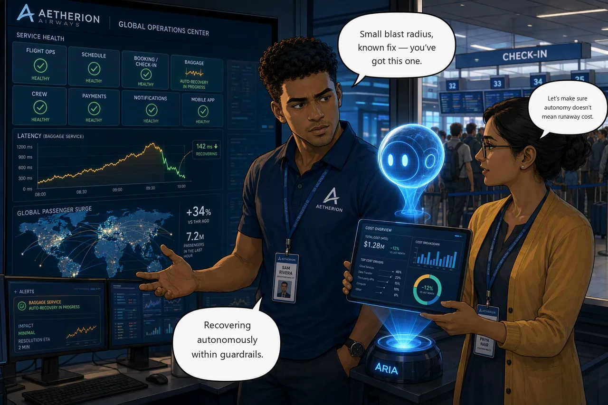

# Challenge 6 · Autonomous Recovery and Cost-Aware Governance

!!! abstract "Challenge 06 of 08 · Act IV: Autonomous & Cost"
    **Run mode:** Autonomous (bounded) · **Governance:** bounded blast radius, no per-action approval

    **Stage:** Foundation → Operations → Engineering → **Autonomous** → Major Incident

**Situation.** Every write so far has waited for your approval. Now a minor issue
appears: the **baggage** service returns intermittent errors to a slice of traffic.
Bags still move, no flight is grounded, and the fix is one you've already seen:
small blast radius, well-understood remedy. That's exactly when it's safe to let the
agent run **autonomously** while you supervise, then make it sustainable at scale
and arm it to trigger itself on the next major incident.

**Mission.** Let the agent recover the baggage service autonomously within
guardrails, design a cost-aware operating model for its Azure Agent Unit (AAU)
usage, and arm a **Sev1** response plan so the next major incident auto-triggers an
investigation, before you reach Challenge 7.

**Why this matters**

<div class="grid cards why-cards" markdown>

- :material-robot-happy-outline: **Bounded autonomy**: let the agent fix a small, safe issue end-to-end
- :material-cash-multiple: **Cost-aware**: see where Azure Agent Units actually go
- :material-tune-variant: **Right-sized**: cut waste without losing reliability
- :material-bell-alert-outline: **Armed for Sev1**: auto-trigger the agent on the next major incident

</div>

!!! example "Start this challenge"

    ```powershell
    ./scripts/start-challenge.ps1 6   # open the incident
    ```

    Give it a couple of minutes. The errors only show up once enough traffic has
    hit the affected slice for the board to average it.

### Tasks

1. **Confirm the symptom.** Verify the baggage errors in the Ops Center and telemetry so you know what "recovered" looks like.
2. **Decide the bounds, then hand over.** Judge whether this incident is safe to automate, switch to **Autonomous** mode, let the agent fix it end-to-end, then review the action log.
3. **See where AAUs go.** Inspect the agent's consumption by thread type and purpose.
4. **Design a cost-aware model.** Name concrete reductions without losing reliability or investigation quality.
5. **Arm the Sev1 response plan.** Connect Azure Monitor as an incident platform, then bind a **Sev1** plan to the pre-provisioned `aetherion-major-incident` alert so the next major incident auto-triggers. Do this now, before Challenge 7.

{ .story-panel loading=lazy }

### Suggested Azure SRE Agent prompt

!!! quote "Paste into the agent chat"
    The `baggage` service is returning intermittent errors to a slice of traffic
    while other requests succeed. Detect the fault, decide the sanctioned reversible
    fix, apply it autonomously, and report exactly what you changed and why it was
    safe to automate.

### Success criteria

- The agent detects the baggage errors, executes a sanctioned fix autonomously, the service returns to healthy, and you can explain why it was safe to automate: small blast radius, a reversible and well-understood remedy, a service that is degraded rather than down, and a run mode you chose deliberately.
- You've reviewed real consumption data and produced a written, defensibly balanced operating model, cost-aware, not merely cheapest.
- A **Sev1 major-incident response plan** is active on the agent (bound to the pre-provisioned `aetherion-major-incident` alert), ready to auto-trigger the agent when the next major incident fires.
- `check-challenge.ps1 6` passes.

!!! warning "Ground truth only"
    Don't invent AAU rates, prices, or savings figures. Use only values present in
    the [official docs](https://learn.microsoft.com/en-us/azure/sre-agent/pricing-billing)
    or your environment. Don't claim that stopping an agent ends all billing.

!!! success "Verify your work"

    Run this when you're done. It grades the real end state, then walks your
    response plan setting by setting. Answer those honestly: a plan that looks
    right and never fires is the one failure that doesn't surface until
    Challenge 7 is already open.

    ```powershell
    ./scripts/check-challenge.ps1 6
    ```

### Hints

<details markdown="1"><summary>Hint: make autonomy safe</summary>

Confirm the symptom first; you can't judge an autonomous recovery without knowing
what healthy looks like.

What makes this one safe to automate isn't a permission setting. It's the shape of
the incident: one degraded (not down) service, a remedy you can undo in seconds, and
a blast radius you can describe in a sentence. Decide that *before* you switch mode,
then switch to Autonomous and resist helping.
</details>

<details markdown="1"><summary>Hint: cost model and the Sev1 plan</summary>

Optimize what you can measure: look at real consumption by thread type and purpose:
consolidation, deleting unused pilots, model fit, and plan/schedule noise are the
biggest levers. Aim for a *balanced* model, not the cheapest. Then wire the **Sev1**
response plan now, matching the pre-provisioned `aetherion-major-incident` alert's
severity exactly, or you'll be wiring it by hand while the board is red in
Challenge 7.
</details>

!!! question "Stuck? Step-by-step for each task"
    Give each task a genuine attempt first, and skim the hints above. When you want
    the exact clicks, open the matching task below.

    ??? note "Task 1 · Confirm the symptom"
        - Check the **baggage** tile and telemetry (Application Insights failed
          requests) so you know the current error rate and what "recovered" means.
        - Some requests succeed and some fail. Ask the agent what is different about
          the ones that fail — the answer is in what sits behind the Service, not in
          the Service itself.
        - `kubectl get pods -n aetherion -l app=baggage --show-labels` shows the same
          thing directly, if you want to confirm the agent's account.

    ??? note "Task 2 · Decide the bounds, then hand over"
        - Write down the bounds first: what may the agent change, what must it never
          touch, and how would you undo it? That judgement is the governance here.
        - Set the run mode to **Autonomous** (on the response plan / task), then let
          the agent detect → decide → fix on its own. Review the action log after.

        !!! note "\"Never delete\" applies to data, not to a bad revision"
            Aetherion's guardrails forbid deleting **data resources**: databases,
            caches, storage. Removing a workload revision that shouldn't be serving
            is an ordinary, reversible rollback, and it is the sanctioned fix here.

    ??? note "Task 3 · See where AAUs go"
        - In the agent, open **Settings → Agent Consumption** and read the breakdown
          by thread type (Chats, Incidents, Scheduled tasks, Triggers) and by thread.

    ??? note "Task 4 · Design a cost-aware model"
        - Write a short operating model naming concrete levers: consolidate workloads
          under one agent, delete unused pilot agents, pick a model that fits the
          task, and trim noisy response plans / schedules, without losing
          reliability, ownership, RBAC, isolation, or investigation quality. Use only
          real figures.

    ??? note "Task 5 · Arm the Sev1 response plan"
        **Connect an incident platform first.** Response plans do not exist until
        you do, and this catches people out.

        1. **Incidents** in the left-hand menu → **Triggers + response plans**.
        2. **Connect an incident platform** → **Azure Monitor** → **Save**. It
           configures itself from your agent's scope, so there is nothing to fill in.
           You'll see **Azure Monitor is connected** in the top right when it's done.
        3. **Delete the quickstart plan.** Connecting a platform automatically
           creates a default **quickstart** response plan. Leave it there and it
           runs alongside yours, which can route the incident to the wrong agent
           or process it twice. Select it and delete it before you continue.
        4. **+ Create a response plan**.

        Fill it in as follows:

        | Field | Value |
        |---|---|
        | Incident response plan name | `aetherion-major-incident-sev1` |
        | **Severity** | **Sev1** |
        | Title contains / does not contain | leave empty |
        | **Response subagent** | **leave empty** |
        | **Agent autonomy level** | **Autonomous** |
        | **Alert reinvestigation cooldown** | **disable it** |

        Then **Next** to see **Incidents preview**, and create.

        **Severity is the whole match.** The environment pre-provisions
        `aetherion-major-incident` at **Sev1**, so a plan filtered to anything else
        catches nothing and a broader plan fires on everything. Leave the title
        filters empty. They are an extra way to miss the alert, not an extra
        safeguard.

        !!! tip "Why not route it to your AKS specialist?"
            The **Response subagent** dropdown is populated by the subagent you
            built in Challenge 5, so it is tempting to select `aks-triage` here.
            Don't.

            Challenge 7's incident spans AKS, API Management **and** PostgreSQL.
            Handing the auto-triggered investigation to an AKS-only specialist
            scopes it to one tier of a four-tier incident. Leave it empty so the
            main agent commands the whole board, and delegate to the specialist
            *within* the incident instead.

            Deciding *not* to use a tool you just built is a real operational
            judgement, and this is the moment to make it.

        !!! warning "Turn the cooldown off for this workshop"
            **Alert reinvestigation cooldown** defaults to enabled at 3 hours: the
            plan skips reinvestigation if the same plan already started one inside
            that window. Sensible in production, wrong here. Re-run Challenge 7
            and the plan silently will not fire the second time.

        !!! danger "Choose Autonomous, and understand what you are choosing"
            Selecting **Autonomous** shows an information icon. Open it and read the
            **Autonomous mode acknowledgment** before you accept: it covers the
            agent's boundaries, the model's limitations, and the fact that scoping
            its access and reviewing its outcomes remain your responsibility.

            In production you would start at **Review** and only promote a plan to
            **Autonomous** once you trust its tool selection. You are promoting it
            after one supervised autonomous recovery in this challenge, which is
            faster than you should move on a real platform. That is a deliberate
            trade so Challenge 7 can show you what unattended response looks like.

        **Autonomy level is per plan**, separate from the agent's own run mode. At
        **Autonomous**, the auto-triggered investigation can mitigate without waiting
        for you. It will not fix everything: it acts where the fix is unambiguous and
        reversible, and leaves the judgement calls. Challenge 7 is built around that
        split, and your first job there is to audit what it decided to do alone.

        Do this **now**. Challenge 7 depends on it auto-triggering, and
        `check-challenge.ps1 6` will ask you about each of the six settings above
        one at a time. Every one of them is a way to end up with a plan that is
        listed, looks correct, and quietly matches nothing.

### Reference

- [Run modes](https://learn.microsoft.com/en-us/azure/sre-agent/run-modes)
- [Pricing and billing](https://learn.microsoft.com/en-us/azure/sre-agent/pricing-billing)
- [Incident response plans](https://learn.microsoft.com/en-us/azure/sre-agent/incident-response-plans)

!!! success "Up next: the final major incident"
    Your Sev1 plan is armed at **Autonomous**. When everything breaks at once, the agent triggers itself and starts working the incident before anyone pages you. You arrive second, and your first job is to audit what it already did.

    [Proceed to Challenge 7 · Final Major Incident →](07-major-incident.md){ .md-button .md-button--primary }

---
