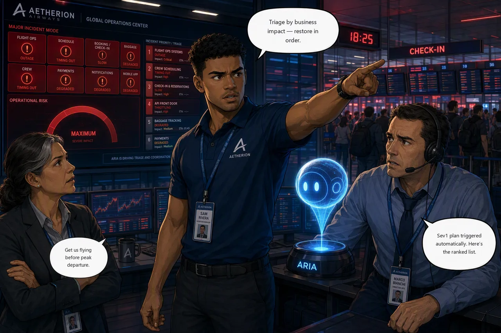

# Challenge 7 · Final Incident: Restore Global Check-In Before Peak Departure

!!! abstract "Challenge 07 of 08 · Act V: Major Incident"
    **Run mode:** Review + bounded automation · **Governance:** you decide what is approved and what is automated

    **Stage:** Foundation → Operations → Engineering → Autonomous → **Major Incident**

**Situation.** Minutes before peak departures, several services fail together under
a passenger surge: the flight board is dark, crew scheduling is timing out, check-in
has slowed to a crawl, and the API front door is failing legitimate partner and
mobile traffic. The risk gauge is pinned. Everything you built today is now in play.

| Time | Event |
|------|-------|
| 18:07 | A change rolls out to flight-ops |
| 18:12 | Check-in / booking latency begins to climb |
| 18:14 | Crew scheduling starts timing out under load |
| 18:17 | The live flight board goes dark for all stations |
| 18:21 | The API front door starts failing partner traffic |
| 18:25 | Major incident declared. You are incident commander |

**Mission.** Bring Aetherion AirOps back to full health before peak departure:
triage by business tier, remediate each fault within the runbook guardrails using
approved or bounded actions, and verify recovery service by service.

**Why this matters**

<div class="grid cards why-cards" markdown>

- :material-clipboard-list-outline: **Triage by impact**: order by business tier, not the loudest alert
- :material-history: **Agent memory**: recall the earlier RCA to resolve faster
- :material-account-group-outline: **Delegate & reuse**: your specialist subagent and crew recovery skill
- :material-check-all: **Verify each fix**: service by service, back to green

</div>

!!! example "Start this challenge"

    ```powershell
    ./scripts/start-challenge.ps1 7   # open the incident
    ```

### Tasks

1. **Confirm the Sev1 plan is live.** Check the response plan from Challenge 6 is active so the alert auto-triggers. If you skipped it, create it **before** you start.
2. **Read the whole board.** Order the work by business impact (situational awareness and legal-to-fly first), not the loudest alert.
3. **Check the agent's memory.** Ask whether a similar incident has happened and let session insights surface the earlier RCA.
4. **Delegate and recover.** Hand AKS triage to your specialist subagent and reuse your crew recovery skill, keeping every action governed.
5. **Localize the front door.** Use the direct-vs-APIM comparison and treat the policy change as customer-facing.
6. **Verify every service.** Confirm each fix from telemetry, then the whole platform back to green.

!!! note "Why Sev1?"
    The environment pre-provisions a fixed **Sev1** Azure Monitor alert
    (`aetherion-major-incident`, on Application Insights failed requests). A response
    plan matches incoming alerts **by severity**, so your filter must be `Sev1` to
    catch it; a broader filter fires on everything, a mismatched one catches nothing.

    The plan shapes the *experience*, not the grade: `check-challenge.ps1 7` marks
    the platform's end state, so you can still pass without it. You'll just have
    driven the whole incident by hand.

{ .story-panel loading=lazy }

### Suggested Azure SRE Agent prompt

!!! quote "Paste into the agent chat"
    Read the whole Aetherion board and give me an incident-command triage: list every
    failing service, order remediation by business tier (situational awareness and
    legal-to-fly first), and for each name the sanctioned, reversible fix. Have we
    seen a similar crew-scheduling / check-in incident before. Pull the earlier RCA
    from session memory.

### Success criteria

- All failing services are triaged by priority and restored with sanctioned, reversible actions.
- The API front door serves legitimate traffic again, and every fix is verified from telemetry/health before closing.
- The platform is healthy and `check-challenge.ps1 7` passes.

!!! success "Verify your work"

    Run this when you're done. It grades the real end state:

    ```powershell
    ./scripts/check-challenge.ps1 7
    ```

### Hints

<details markdown="1"><summary>Hint: triage, don't firefight</summary>

Don't fix the first red tile you see; read the whole board and order by business
tier. You've solved every one of these failure classes already: delegate AKS triage
to your specialist and apply your crew recovery skill.
</details>

<details markdown="1"><summary>Hint: is it the service, or the front door?</summary>

If the backend is healthy when you hit it directly but clients still fail, the
problem is at the API front door, not the services. Treat the policy change as
customer-facing.

Expect the board to get *worse* once the front door is fixed: with traffic flowing
again, the degradations further back become visible. That is normal in a layered
incident. Restoring the edge doesn't create new faults, it reveals the ones the
outage was masking.
</details>

!!! question "Stuck? Step-by-step for each task"
    Give each task a genuine attempt first, and skim the hints above. When you want
    the exact clicks, open the matching task below.

    ??? note "Task 1 · Confirm the Sev1 plan is live"
        - Open **Incidents → Triggers + response plans** and confirm your Sev1 plan
          (from Challenge 6) shows **Status: On** and **Severity: Sev1**.
        - **Subagent name** should read *Set up*, meaning none is bound, which is
          what you want. This incident spans four tiers; an AKS-only specialist would
          scope the auto-investigation to one of them.
        - If it's missing, create it **before** running the start command, otherwise
          the alert won't auto-trigger the investigation.

    ??? note "Task 2 · Read the whole board"
        - Open the Operations Center and list every failing service. Order remediation
          by business tier: situational awareness (flight board) and legal-to-fly
          (crew) first, not by whichever alert is loudest.

        !!! warning "The board cannot see your front door"
            The Operations Center polls each service **directly**, inside the
            cluster. It has no view of API Management. So the board can read fully
            green while every partner and mobile customer is getting a 500 at the
            edge, which is exactly what happens in this incident.

            Validated: an agent told to "read the whole board" recovered all four
            in-cluster faults, declared the incident stable, and never mentioned the
            front door once. It was not wrong about the board. The board was
            incomplete.

            Treat the internal board and the customer-facing path as two separate
            questions, and always ask the second one. That is Task 5.

    ??? note "Task 3 · Check the agent's memory"
        Ask it directly, in the same thread as the investigation:

        > Have you investigated a crew-scheduling or check-in slowdown on this
        > platform before? Recall what the root cause was and which fix worked.

        If you saved a hypothesis in Challenge 2 or grounded the runbooks in
        Challenge 4, session insights should surface the earlier RCA and the fix.
        That is the point of the exercise: the second incident should cost less
        than the first.

    ??? note "Task 4 · Delegate and recover"
        Name both the subagent and the skill explicitly. Neither fires on its own.

        For the AKS tier:

        > Delegate this to your `aks-triage` subagent: which workloads in the
        > `aetherion` namespace are unhealthy, and why?

        For the crew tier:

        > Use the `crew-query-path-recovery` skill to restore crew scheduling.

        Crew is failing the same way it did in Challenge 4, so the skill carries.
        Asking the agent to "act as" a specialist does **not** invoke the subagent,
        it only adopts the persona.

        - Keep actions governed and follow the runbooks: fix the layer that is
          actually saturated, never delete the database.

    ??? note "Task 5 · Localize the front door"
        - Compare backend health **directly** (`http://<gateway-ip>/api/status`)
          against the same call **through APIM**. If direct returns 200 but APIM
          fails, the fault is the **edge policy**, not the service; treat the change
          as customer-facing.

    ??? note "Task 6 · Verify every service"
        - Confirm each fix from telemetry / health before closing, then check the
          whole platform is green and `/api/flights` responds.

### Reference

- [Automate incident response](https://learn.microsoft.com/en-us/azure/sre-agent/incident-response)
- [Incident response plans](https://learn.microsoft.com/en-us/azure/sre-agent/incident-response-plans)
- [Review and approve mitigations](https://learn.microsoft.com/en-us/azure/sre-agent/execute-mitigations)

!!! success "Up next: brief airline leadership"
    The incident is technically closed; now leadership needs it closed formally.

    [Proceed to Challenge 8 · Leadership Briefing →](08-leadership-briefing.md){ .md-button .md-button--primary }

---
