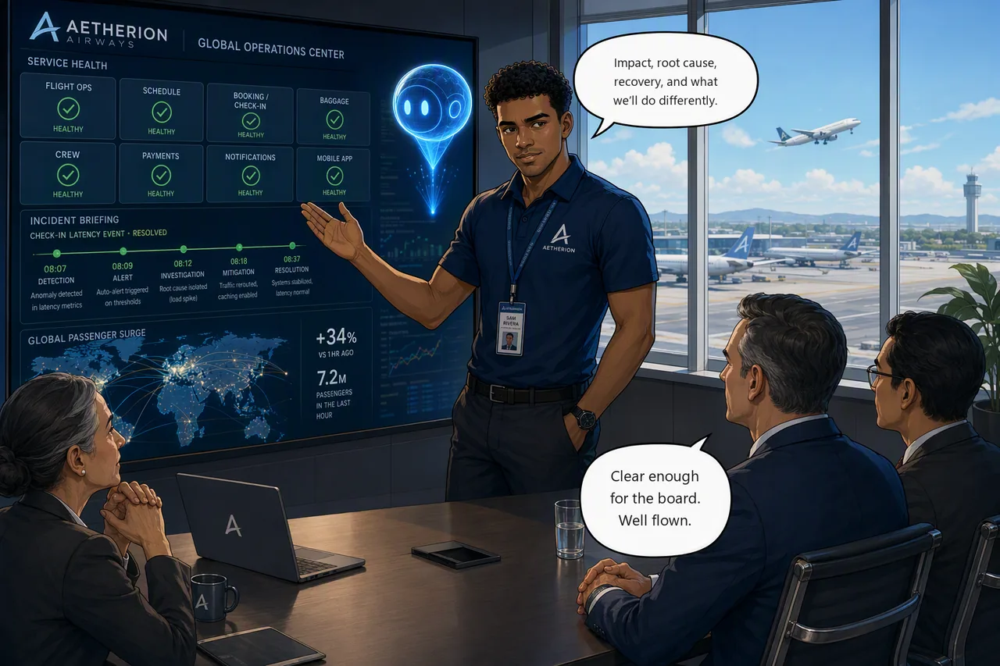

# Challenge 8 — Boarding Resumes: Brief Airline Leadership

!!! abstract "Challenge 08 of 08 · Act V — Major Incident"
    **Agent mode:** Read-only summarization · **Permissions:** Reader · **Estimated time:** 20–30 min

    **Stage:** Foundation → Operations → Engineering → Autonomous → **Major Incident**

**Situation.** The platform is stable and the peak departure bank is away safely. A
major incident isn't closed when the tiles go green — it's closed when leadership
understands it and the team has captured what to do differently.

**Mission.** Turn the shift's evidence into two artifacts — a concise leadership
briefing and an engineering RCA handover — that cleanly separate symptom, root cause,
contributing factors, mitigation, permanent fix, recovery evidence and remaining
risk.

**Why this matters**

<div class="grid cards why-cards" markdown>

- :material-file-document-outline: **Two audiences** — a leadership briefing and an engineering RCA
- :material-podium: **Impact-first** — what happened and what it cost, for executives
- :material-clipboard-text-clock-outline: **Precise handover** — actions, verification and open risks for the next on-call
- :material-file-chart-outline: **Boardroom-ready** — an auto-generated PDF with a timeline chart

</div>

!!! example "Start this challenge"

    ```powershell
    ./scripts/start-challenge.ps1 8   # open / set up this challenge
    ```

### Tasks

1. **Assemble the evidence** — build one defensible narrative per incident from what you preserved through the shift.
2. **Write the leadership briefing** — short, impact-first, non-technical, for the operations director.
3. **Write the engineering RCA handover** — precise actions, verification, open risks, and change-correlation evidence (Activity Log + GitHub) for the next on-call.
4. **Generate the executive PDF** — have the agent render the briefing (with an incident-timeline chart) via its built-in **Python sandbox**.

!!! question "Stuck? Full walkthrough available"
    Give each task a genuine attempt before reaching for help — working it out
    yourself is where the learning sticks. Only if you get truly stuck, the
    [Azure portal walkthrough](../getting-started/portal-walkthrough.md) has the
    exact click-by-click for every step.

{ .story-panel loading=lazy }

### Suggested Azure SRE Agent prompt

!!! quote "Paste into the agent chat"
    From today's preserved evidence and action plans, draft two separate artifacts:
    (1) a concise, impact-first **leadership briefing** (business impact, root cause,
    recovery, cost/risk, lessons learned) and (2) an **engineering RCA handover**
    (actions taken, how each was verified, open risks, and Activity Log + GitHub
    change references). Then render the leadership briefing as a formatted **PDF**
    with an incident-timeline chart using your Python sandbox.

### Success criteria

- The platform is healthy at close.
- The leadership briefing covers impact, root cause, recovery, cost/risk, and lessons learned; the engineering RCA handover captures actions, verification, remaining risk, and change evidence.
- The agent produced a **downloadable PDF** of the leadership briefing (with a timeline chart) via its Python sandbox.
- Symptom, root cause, contributing factors, immediate mitigation, and permanent corrective action are clearly separated, and `check-challenge.ps1 8` passes.

!!! success "Verify your work"

    Run this when you're done — it grades the real end state and completes the hack:

    ```powershell
    ./scripts/check-challenge.ps1 8
    ```

### Hints

<details markdown="1"><summary>Hint</summary>

Start from the evidence you preserved, not memory — let the agent's action plans
jog the timeline. Leadership wants impact and outcome; the next on-call wants exact
actions, root-cause evidence, and open risks — write both, not one blended document. Feed the lessons
learned back into the agent's knowledge so recurrence is handled faster next time.
</details>

### Reference

- [Azure SRE Agent overview](https://learn.microsoft.com/en-us/azure/sre-agent/overview)
- [Team onboarding & memory](https://learn.microsoft.com/en-us/azure/sre-agent/team-onboard)
- [Azure portal walkthrough](../getting-started/portal-walkthrough.md) · [Architecture](../reference/architecture.md) · [Commands](../reference/commands.md)

!!! success "🎉 MicroHack complete — you built an AI SRE teammate from scratch"
    Across eight challenges you onboarded, investigated, recovered, grounded,
    engineered, automated, and closed a Tier-0 major incident with the Azure SRE
    Agent.

    [Finish & wrap up →](finish.md){ .md-button .md-button--primary }

---
