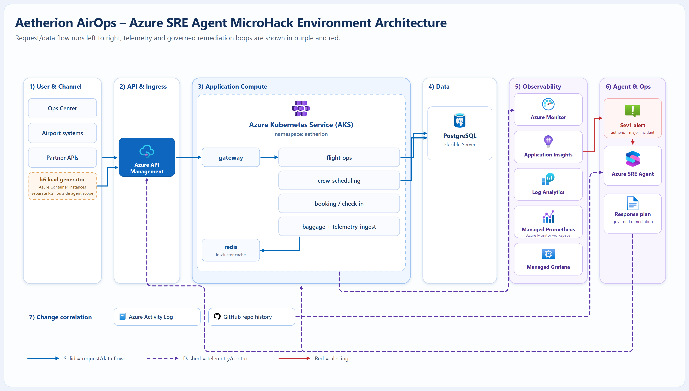

# Set up the environment

This is the only setup step. One command provisions the entire Aetherion AirOps
platform on Azure, then hands you straight to Challenge 1.

## 1. Install the required tools (Windows)

| Tool | Minimum version | Notes |
|------|-----------------|-------|
| PowerShell | 7.0 | required |
| Azure CLI | 2.60 | required |
| kubectl | any recent | required |
| Docker Desktop | any recent | required |
| Git | any recent | required |

```powershell
winget install --id Microsoft.PowerShell --exact --accept-source-agreements --accept-package-agreements
winget install --id Microsoft.AzureCLI --exact --accept-source-agreements --accept-package-agreements
winget install --id Kubernetes.kubectl --exact --accept-source-agreements --accept-package-agreements
winget install --id Docker.DockerDesktop --exact --accept-source-agreements --accept-package-agreements
winget install --id Git.Git --exact --accept-source-agreements --accept-package-agreements
```

After installs complete, restart your terminal so the commands are available on PATH.

## 2. Get the two repositories

You use **two** repositories in this MicroHack:

**a) Clone the lab repo** — it drives the hack (challenges + scripts):

```powershell
git clone https://github.com/abengtss-max/azure-sre-agent-microhack.git
cd azure-sre-agent-microhack
```

**b) Fork the application repo** — this is the Aetherion AirOps *application*
source that the Azure SRE Agent connects to for change correlation. Fork it to
**your own account** so the agent can read its history and open pull requests:

1. Open <https://github.com/abengtss-max/aetherion-airops-platform>
2. Click **Fork** (keep the default name).

You'll connect the SRE Agent to **your fork** in Challenge 1. Never connect the
agent to the lab repo — it contains the challenge material.

## 3. Check you have access

- **Azure subscription** with **Owner** (or Contributor + User Access
  Administrator) — the provisioner deploys infrastructure and assigns the agent's
  managed identity.
- This repository cloned locally and opened in VS Code.

```powershell
az login
az account set --subscription "<subscription-id>"
```

## 4. Run one command

```powershell
./scripts/provision-environment.ps1
```

That's it. The script is idempotent — safe to re-run if a step fails. It runs
preflight → deploy infrastructure → build & push images → deploy the app →
validate, then opens the Operations Center, Grafana, and the resource group in
your browser.

Defaults: resource group `rg-aetherion-microhack`, region `swedencentral`.
Override with `-ResourceGroup`, `-Location`, or `-NamePrefix` if needed.

## 5. What gets deployed

[{ .arch-diagram loading=lazy }](../assets/architecture/aetherion-architecture.png)

*Request/data flow runs left to right (solid blue); telemetry and control flow to
observability and the Azure SRE Agent (dashed purple); alerting is shown in red.
**Click the diagram to open it full size.** See the [full architecture reference](../reference/architecture.md) for the deep dive.*

| Layer | Resources |
|-------|-----------|
| Edge | Azure API Management (subscription-key auth, rate limiting) |
| Compute | AKS cluster `aetherion-aks`, namespace `aetherion` — 6 microservices + k6 load generator |
| Data | Azure Database for PostgreSQL Flexible Server · Azure Managed Redis |
| Observability | Application Insights `aetherion-appi` · Log Analytics `aetherion-law` · Azure Managed Grafana |
| Agent | Azure SRE Agent `aetherion-sre-agent` |

## 6. Confirm it's healthy, then start

When the script finishes it prints a **validation summary**. You're ready when it
reports a healthy, traffic-generating estate and the Operations Center loads with
all tiles green.

Re-run the check on its own at any time:

```powershell
./scripts/04-validate.ps1 -ResourceGroup rg-aetherion-microhack
```

[Start Challenge 1 →](../challenges/01-onboard-and-baseline.md){ .md-button .md-button--primary }

---

<details markdown="1"><summary>What each component is for (reference)</summary>

| Component | Purpose | Where |
|-----------|---------|-------|
| Operations Center GUI | Live service health, risk gauge, flight map, incidents, business impact | `https://sreagenthack-XXXXX.<region>.cloudapp.azure.com/` |
| API front door | Partner/mobile entry point, subscription-key auth, rate limiting | `<apim-gateway-url>/aetherion/api/status` |
| PostgreSQL database | System of record for bookings, crews, and telemetry writes | Azure Database for PostgreSQL Flexible Server |
| Redis cache | Low-latency cache for booking/check-in read patterns | Azure Managed Redis |
| Dashboards | Metrics, traces, log visualizations | Azure Managed Grafana |
| App telemetry | Requests, dependencies, exceptions, app map | Application Insights `aetherion-appi` |
| Logs | Container and node logs/metrics | Log Analytics `aetherion-law` |
| Compute | All microservices | AKS `aetherion-aks`, namespace `aetherion` |
| Load generator | Produces synthetic traffic during the workshop | AKS deployment `k6-load` |
| Change history | Resource and deployment changes | Azure Activity Log + GitHub repo |
| Azure SRE Agent | Investigate, plan, and remediate — with approval, or bounded autonomy | Azure portal → `aetherion-sre-agent` |

Microservices: `gateway`, `flight-ops`, `crew-scheduling`, `booking`, `baggage`,
`telemetry-ingest` (plus `k6-load` for workshop traffic generation).

</details>

