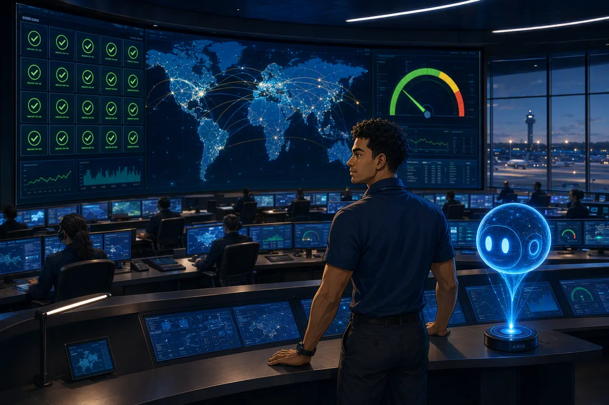
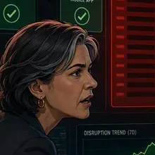
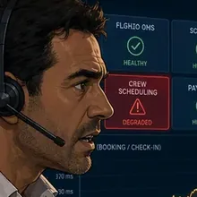
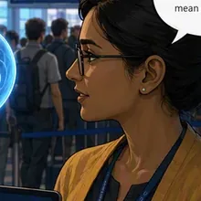

# You are the new reliability team for a global airline platform

{ .story-panel loading=lazy }

Aetherion AirOps is a fictional, Tier 0 airline operations platform running on
Microsoft Azure. It is the digital backbone of a global carrier's day-to-day
flying: it runs flight operations and dispatch, crew scheduling, passenger
booking and check-in, baggage tracking, aircraft telemetry ingestion, and the
airport and operational dashboards that controllers watch during every shift.

The platform is **Tier 0** because when it degrades, aircraft do not move on
time. A slow check-in service strands passengers at the gate. A crew-scheduling
outage stops duty managers from confirming who is legal to fly. A dark flight
board removes the operational picture an entire operations center depends on.
The impact is measured in delayed departures, missed connections, stranded
baggage, service-level breaches, and reputational damage.

Today you join Aetherion AirOps as its new Site Reliability Engineering team. You
will run a shift inside the Global Operations Center, take a series of real
incidents as they unfold, and use **Azure SRE Agent** to investigate, decide, and
recover, under the same guardrails a real airline would insist on.

> This is an operational and business platform built for learning. It is **not**
> safety-of-flight avionics and it does not control real aircraft. Every fault in
> this MicroHack is deliberately injected and fictional.

---


## Who you'll be working with

You share the Operations Center with four others. You meet them as the day
brings them in — you don't need to remember them now.

<div class="grid cards cast-cards" markdown>

-   { .cast-portrait loading=lazy }

    __Sam Rivera__ · Reliability engineer

    ---

    **This is you.** New to Aetherion, on shift in the Global Operations Center.
    Every decision in this hack is yours to make.

-   { .cast-portrait loading=lazy }

    __Aria__ · Azure SRE Agent

    ---

    **Not a colleague — the agent itself.** The blue hologram beside you in every
    scene is the thing you connect in Challenge 1 and govern all day.

-   { .cast-portrait loading=lazy }

    __Elena Vasquez__ · Operations director

    ---

    Answers for the airline. Wants it fixed *safely*, with a human in the loop,
    and wants the incident explained in business terms afterwards.

-   { .cast-portrait loading=lazy }

    __Marco Bianchi__ · Crew duty manager

    ---

    Runs the crew desk. When crew scheduling degrades, he is the one who cannot
    confirm who is legal to fly.

-   { .cast-portrait loading=lazy }

    __Priya Nair__ · FinOps analyst

    ---

    Watches what the platform *and* the agent cost. Autonomy is only a win if it
    doesn't become runaway spend.

</div>

---


## The shift ahead: challenge map

| # | Challenge | What you practice |
|---|-----------|-------------------|
| 1 | Onboard the Agent and Establish the Baseline | Environment discovery, connect the agent read-only, capture a baseline + a daily proactive health check |
| 2 | Detect and Investigate Without Touching Production | Detect a symptom, then read-only telemetry/log correlation and a defensible hypothesis |
| 3 | Controlled Recovery and Change Correlation | Human-approved remediation, then correlate a second incident with recent change and roll back |
| 4 | Give the Agent Aetherion's Operational Knowledge | Ground the agent so it follows your runbooks |
| 5 | Engineer the Agent: Specialist Subagent + Skill | Create a custom specialist subagent and encode a repeatable recovery as a skill |
| 6 | Autonomous Recovery and Cost-Aware Governance | Let the agent fix a bounded incident on its own, then run it cost-consciously |
| 7 | Final Incident: Restore Global Check-In Before Peak Departure | End-to-end multi-fault response as incident commander |
| 8 | Boarding Resumes: Brief Airline Leadership | Incident summary and leadership handover |

---


## How the day works

The challenges form **one continuous storyline**, not a set of unrelated
tutorials. Each challenge begins where the last one ended: the baseline you
capture early is the evidence you compare against later; the permissions you
reason about become the approvals you rely on; the knowledge you load changes the
advice the agent gives; the specialist agent and skill you build are the tools
you reach for in the final incident.

Challenges unlock **linearly**: you finish one before the next opens. You drive
each challenge yourself with two commands:

```powershell
./scripts/start-challenge.ps1 <N>   # opens the incident for challenge N (root cause hidden)
./scripts/check-challenge.ps1 <N>   # validates the required end state and unlocks challenge N+1
```

- `start-challenge.ps1` injects the incident (or sets up a configuration
  exercise) **without telling you the root cause**. That is your job to find.
- `check-challenge.ps1` verifies the real end state against the live cluster and
  API Management, then unlocks the next challenge. A symptom-only or "wait it
  out" fix will not pass. The underlying fault must genuinely be cleared.

**Work from evidence.** Each challenge gives you the scenario, the business
stakes, the signals you can inspect, the guardrails, and progressive hints,
which is enough to investigate and solve it yourself. Start read-only, use the least
privilege that gets the job done, and let write actions go through approval
unless a challenge explicitly enables bounded automation. Verify recovery with
telemetry after every change, and preserve the evidence you will need for the
incident summary at the end of the shift.

**Use the agent to do the work; use `kubectl` to check the agent.** You have a
terminal, and some of these incidents would be faster to fix by hand. Resist it.
The point of the day is to find out where an agent earns its place and where it
doesn't, and you learn nothing about that by racing it. Where a challenge does ask
you to run something directly, it is to verify a claim the agent made — auditing an
agent through the agent tells you nothing.

Challenges 2 and 3 are **one ongoing incident**: detection and read-only
investigation, then controlled recovery, before a change-driven flight-board
outage is layered on top in Challenge 3.

---

!!! success "Your shift starts now"
    The board is green, Aria is waiting, and nothing is on fire yet. Go and find
    out what *healthy* looks like before something isn't.

    [Start Challenge 1 →](../challenges/01-onboard-and-baseline.md){ .md-button .md-button--primary }

