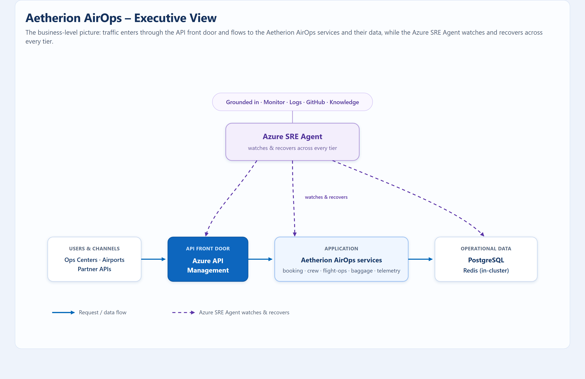

# Architecture

Aetherion AirOps is a microservices estate on Azure Kubernetes Service, fronted
by Azure API Management, backed by PostgreSQL and Redis, and observed through
Application Insights, Log Analytics and Grafana. The **Azure SRE Agent** reasons
across every tier — not just the cluster.

## Environment at a glance

[{ .arch-diagram loading=lazy }](../assets/architecture/aetherion-architecture.png)

*Request/data flow runs left to right (solid blue); telemetry and control flow to
observability and the Azure SRE Agent (dashed purple); alerting is shown in red.
**Click the diagram to open it full size.** The agent runs governed remediation back into APIM and AKS, correlating change via
Azure Activity Log and GitHub history.*

## Executive view

[{ .arch-diagram loading=lazy }](../assets/architecture/aetherion-executive.png)

*The business-level picture: traffic enters through the API front door, flows to
the Aetherion AirOps services and their data, and the **Azure SRE Agent** watches
and recovers across every tier — grounded in monitoring, source control and your
runbooks. **Click to open full size.***

## Where faults hide

The symptom almost always appears at the **edge** (APIM 5xx or timeouts), but the
root cause can live in any tier. The hack deliberately rotates incidents across
the gateway, the cluster and the database so attendees learn to reason across the
whole estate.

| Tier | Example fault | First signal |
|------|---------------|--------------|
| Edge — APIM | Restrictive rate-limit policy | HTTP 429 under load |
| Compute — AKS | Crashing pod, memory pressure | Pod restarts, 5xx |
| App logic | Injected latency or errors | Slow responses, exceptions in App Insights |
| Data — PostgreSQL | Connection-pool exhaustion | Timeouts, saturation in Grafana |
| Data — Redis | Cache unavailability | Elevated latency on booking/check-in |

## Observability plane

- **Operations Center GUI** — live service health, operational-risk gauge, flight
  map, incidents and business impact. First place to confirm a symptom.
- **Application Insights** (`aetherion-appi`) — requests, dependencies,
  exceptions and the application map.
- **Log Analytics** (`aetherion-law`) — container and node logs for deep-dive KQL.
- **Azure Managed Grafana** — metrics, traces and autoscaling correlation.
- **Azure Activity Log + GitHub** — change history for incident correlation.
